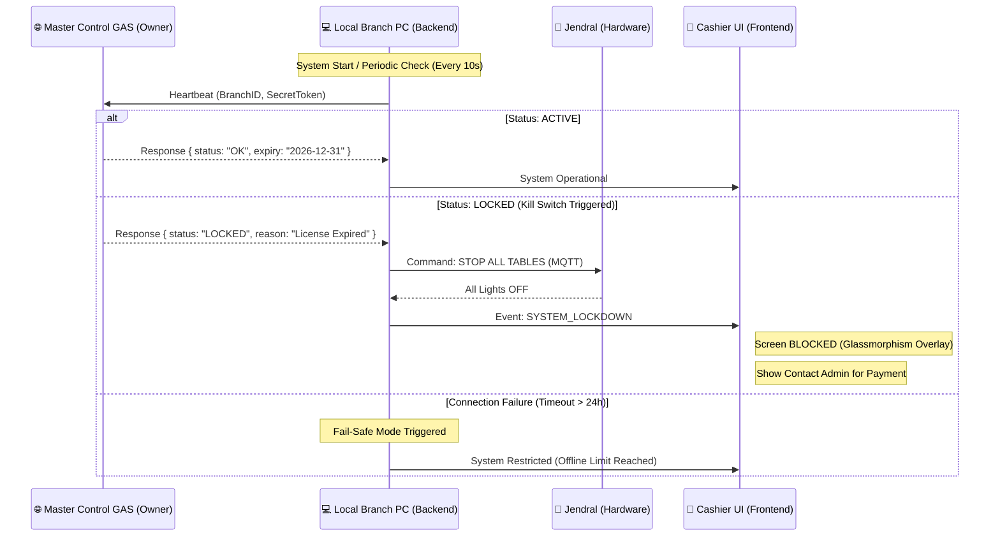

# 🛡️ Master Control & License Guard Architecture
**Project: VOC Billiard Multi-Branch Remote Management**

## 1. System Overview
This system allows the Master Provider (You) to remotely manage, monitor, and instantly lockdown any billiard location using a centralized Google Apps Script (GAS) Dashboard.

## 2. Logic Flowchart

## 3. Component Details

### A. Master Control GAS (The Brain)
*   **Database (Sheets)**: Stores `BranchID`, `BranchName`, `CurrentStatus`, `LicenseExpiry`, and `LastHeartbeat`.
*   **UI Dashboard**: A web portal for you to toggle the "Kill Switch" for any branch.
*   **Security**: Uses a shared secret token to ensure only your backends can talk to it.

### B. Local Backend Guard (The Enforcer)
*   **Service**: `LicenseGuardService` running as a background task.
*   **Lockdown Action**: 
    1.  Broadcasts `lockdown` signal via Socket.io to all connected Frontends.
    2.  Sends MQTT `forced_stop` to Jendral ESP32.
    3.  Disables all API endpoints except the `/license` status check.

### C. Frontend Overlay (The Visual)
*   A high-priority React component that wraps the entire application.
*   If `isLocked == true`, it renders a non-closable modal with:
    *   "Sistem Terkunci (Lisensi Berakhir)"
    *   Detailed branch ID for identification.
    *   Direct link/QR to WhatsApp Support.

## 4. Key Security Features
1.  **Hardware Binding**: The `BranchID` can be tied to the physical hardware ID of the PC to prevent software cloning.
2.  **Encrypted Heartbeat**: Data sent between PC and GAS is encrypted or signed to prevent tampering.
3.  **Autonomous Lockdown**: If the PC clock is tampered with (backdating) or internet is cut for too long, the system locks itself to prevent bypassing the expiry date.

## 5. Deployment Plan
1.  **Stage 1**: Create `LicenseService` in Backend to handle heartbeat.
2.  **Stage 2**: Deploy the **Master GAS** script for central management.
3.  **Stage 3**: Implement the `SystemLockOverlay` in the React Frontend.
