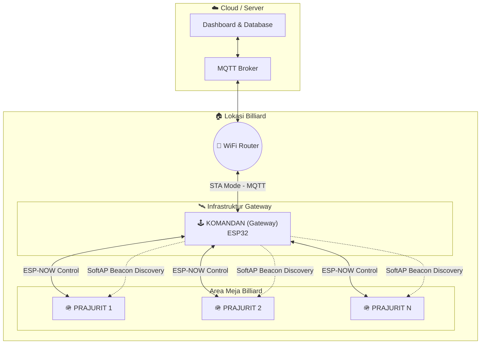

# 🎱 VOC Billiard Management System
> **Hybrid MQTT + ESP-NOW Infrastructure (Multi-Floor Architecture)**
> Versi: 5.0 (Async-Discovery v6) | Update: 2026-04-15

Sistem manajemen lampu meja billiard berbasis IoT yang dirancang untuk stabilitas tinggi, instalasi mandiri (Zero-Config), dan performa "Secepat Kilat". Solusi ini menggunakan kombinasi **MQTT** untuk kontrol jarak jauh dan **ESP-NOW** untuk komunikasi lokal antar meja tanpa bergantung pada kestabilan router WiFi lokal.

---

## 📐 Arsitektur Sistem

Sistem dibagi menjadi dua peran utama yang membentuk hierarki "Komandan & Prajurit":

1.  **KOMANDAN (Gateway)**:
    *   **Hardware**: ESP32 WROOM-32.
    *   **Koneksi**: WiFi STA (ke Router) + WiFi AP (untuk Discovery) + ESP-NOW.
    *   **Fungsi**: Jembatan antara Dashboard/Server (via MQTT) ke Meja-meja (via ESP-NOW).
2.  **PRAJURIT (Node)**:
    *   **Hardware**: ESP32 / ESP32-C3 Super Mini.
    *   **Koneksi**: ESP-NOW Pure (Tidak perlu WiFi SSID/Password).
    *   **Fungsi**: Kontrol Relay/MOC3062 untuk lampu meja billiard.

---

## 🌐 Topologi Sistem



### Alur Komunikasi
*   **Jalur Kontrol**: Dashboard → MQTT → Router → Komandan → ESP-NOW → Prajurit (Meja).
*   **Jalur Discovery**: Prajurit melakukan scan WiFi untuk menemukan SSID Komandan → Ambil info channel → Kunci channel ESP-NOW.
*   **Resiliensi**: Jika internet mati, kontrol lokal tetap bisa diusahakan via ESP-NOW selama Komandan tetap menyala.

---

## 🚀 Fitur Unggulan

### 1. Async-Discovery v6 (Secepat Kilat)
Menghilangkan masalah *stack memory overflow* pada ESP32-C3. Proses pencarian channel dilakukan secara asinkron di latar belakang.
*   **Kecepatan**: Sinkronisasi channel dalam **< 1 detik** (cached) atau **< 3 detik** (fresh scan).
*   **Interactive Probe**: Komandan akan langsung membalas "teriakan" Prajurit secara instan untuk penguncian channel yang presisi.

### 2. Zero-Config Deployment (Provisioning Portal)
Client tidak perlu keahlian teknis atau laptop untuk instalasi:
*   Komandan baru akan membuka portal WiFi **"KOMANDAN-SETUP-Lx"**.
*   Konfigurasi WiFi, IP Server, dan Nomor Lantai dilakukan via HP.
*   Mendukung **Captive Portal** (Halaman login otomatis muncul).

### 3. Sistem 3 Lapis Keamanan Channel (Auto-Healing)
*   **LAPIS 1**: Validasi cache SPIFFS saat boot awal.
*   **LAPIS 2**: Real-time Beacon Monitoring (Update channel otomatis tanpa restart jika router pindah channel).
*   **LAPIS 3**: Auto-Resync (Pencarian ulang total jika kehilangan sinyal selama 3 menit).

### 4. Manajemen Remote via MQTT
*   **Beacon Force**: Paksa seluruh meja sinkronisasi dari dashboard.
*   **Status Query**: Cek info channel, uptime, dan kekuatan sinyal (RSSI) meja secara remote.

---

## 🛠 Panduan Instalasi (Developer)

### 1. Persiapan Komandan (`espnow_gateway_komandan.ino`)
1.  Buka file di Arduino IDE.
2.  Ubah `MQTT_DEFAULT_SERVER` dan `FLOOR_DEFAULT` di bagian konfigurasi.
3.  Flash ke ESP32.
4.  Setelah flash, buka Serial Monitor dan **catat MAC STA** yang muncul (Contoh: `70:4B:CA:8F:72:54`).

### 2. Persiapan Prajurit (`espnow_node_prajurit.ino`)
1.  Buka file di Arduino IDE.
2.  Ubah `MESA_ID` sesuai nomor meja (meja 1, 2, dst).
3.  Ubah `GATEWAY_MAC`: Masukkan MAC Komandan yang sudah dicatat tadi (Pastikan **sama persis**).
4.  Flash ke ESP32 / ESP32-C3.

---

## 🔌 Panduan Instalasi (Client di Lokasi)

1.  **Colok Komandan**: Tunggu LED berkedip cepat.
2.  **Konek HP**: Hubungkan HP ke WiFi "KOMANDAN-SETUP-Lx".
3.  **Config**: Form akan muncul otomatis. Isi WiFi lokal, Password, dan IP Server. Klik Simpan.
4.  **Selesai**: Komandan akan restart dan LED menyala solid. Colok semua Prajurit, dan meja akan online otomatis.

---

## 📡 Protokol Komunikasi

### Paket Beacon (Komandan → Semua)
Dikirim secara broadcast untuk sinkronisasi channel.
```json
{
  "type": 0xBC,
  "floorId": 1,
  "channel": 4,
  "timestamp": 123456
}
```

### Paket Kontrol (Komandan → Prajurit)
```json
{
  "mesaId": 13,
  "cmd": 1, 
  "extend": false,
  "force": true
}
```
*   `cmd 1`: ON, `cmd 0`: OFF, `cmd 9`: REBOOT.

---

## ⚠️ Keamanan & Reset Hardware

*   **Reset Total**: Tahan tombol **BOOT** pada Komandan selama **5 detik** untuk menghapus seluruh konfigurasi WiFi dan kembali ke mode Setup.
*   **Isolasi Lantai**: Prajurit hanya akan menuruti perintah dari MAC Komandan yang didaftarkan. Sinyal dari Komandan lantai lain akan diabaikan secara otomatis.

---

## 🗂 Struktur File

| Nama File | Deskripsi |
|-----------|-----------|
| `espnow_gateway_komandan.ino` | Firmware Gateway (WiFi + MQTT + ESP-NOW) |
| `espnow_node_prajurit.ino` | Firmware Meja (ESP-NOW + Relay Control) |
| `ARSITEKTUR_MULTI_LANTAI.md` | Dokumentasi teknis mendalam dan diagram. |
| `node_config.json` | Konfigurasi internal yang disimpan di SPIFFS. |

---

*Dokumentasi ini dibuat untuk sistem **VOC Billiard Management**. Dilarang mengubah konfigurasi MAC tanpa pendampingan teknis.*
